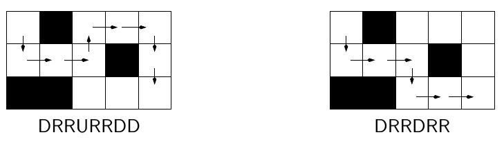
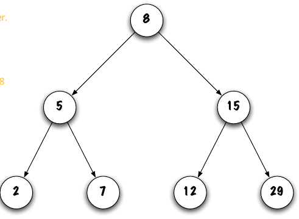

# ITI 1121 Whole Year Cheet Sheet
Owen Daigle

---

## Data Types
Java has primitive and reference data types. 

All primitive data types have a corresponding reference data type denoted the *Wrapper Class*. 

All primitive data types are lowercase, and all reference types are Capitalised. The exception are arrays. Arrays are reference types, but an array of primitives is defined as:
```java
int[] myArray = new int[5];
```

| Primitive | Reference        |
| --------- | ---------------- |
| `int`     | `Integer`        |
|           | `String`         |
| `double`  | `Double`         |
|           | Any Custom Class |

When we have a method, we denote its parameters in the method definition as the *formal parameters*, and the *actual parameters* as the real variables we send in when calling the method. 

```java
//a and b are the formal parameters
int sum(int a, int b) {
    return a+b;
}

//1 and 2 are the actual parameters
int total = sum(1+2);
```

## Classes
When we are working with classes, we want to make a class be as flexible as possible. We want it to be able to work with lots of data types. 

We also want said class to only have certain methods accessible to the outside world. 
> If we have a bank account class, we do not want the outside world to be able to arbitrarily change the balance, it needs to go through the right methods.

These are the different visibilities:

| | Public | Package | Protected | Private |
| - | - | - | - | - |
| Same Class | Y | Y | Y | Y |
| Class in Same Package | Y | Y | Y | N |
| Subclass in same package | Y | Y|Y|N|
|Subclass outside the package| Y|N|Y|N|
|Other class outside package |Y|N|N|N|


We do not *create* classes when running the program, we create *objects* or *instances of the class*. 

```java
//this is just the class. It is like a blueprint
public class random {
    //this variable cannot be accessed outside the class.
    private int value = 0;

    //this method can be accessed from outside the class, and it can access the value since it is in the class. 
    public int getVal() {
        return this.value;
    }
}

//this is one instance of the class (an object)
random R1 = new random();

//this is another instance of the class (another object)
random R2 = new random();
```

## Inheritance
If we want to create a program for people at a school, we will have some methods that are for everyone (`age`, `name`), some for only students (`student number`, `classes`) and some for only teachers (`salary`).

We can use inheritance to avoid duplicating some code. 

We say that:

```java
public class Person {
    private int age;
    private String name;
    //...
}
public class Student extends Person {
    private int studentNumber;
    private String[] classes;
    //...
}

public class Teacher extends Person {
    private double salary;
    //...
}
```

If we have 2 methods, one in the parent class, and on in the child class, then the child takes priority. 

```java
public class Animal {
    private int age;
    private String name;
    
    public void say() {
        System.out.println("I am an animal");
    }
    
}
public class Dog extends Animal {
    public void say() {
        System.out.println("I am a dog");
    }
}

//I am creating a Dog which is a subclass of Animal
Dog cludge = new Dog();

//this will output "I am a dog"
cludge.say();
```

## Polymorphism
This literally means "Many Forms". Something is polymorphic if it refers to more than one class/type. 

If we have 2 classes, `rectangle` and `circle`, and want a method to find whether one is left of the other one, then we do not want to have to create this for both `rectangle`, or `circle`. 

So we will add the method to the parent class of `Shape` that takes in a `Shape`.

```java
public class Shape {
    private int X;

    public boolean isLeftOf(Shape s) {
        return this.getX() < s.getX();
    }
    //define getters, setters, etc...
}

public class rectangle extends Shape {
    //...
}

public class circle extends Shape {
    //...
}

Circle c = new Circle (...);
Rectangle r = new Rectangle (...);

//this works since c is a Shape, and r is a Shape. So the method looks at c as a Shape, and looks at r as a Shape. 
System.out.println(c.isLeftOf(r));
```

If we want to add an `area()` method, then we must do this for each different subclass of `Shape`. There is no way around this. 

### Abstract Classes

To ensure that each subclass of shape has the `area()` method, we can make it an abstract class. This means that `Shape` itself cannot be instanciated, but **all** its subclasses **must** have implementations of all abstract methods in the class. 

```java
public abstract class Shape {
    //this method ***must** be implemented in all subclasses of shape. 
    public abstract double area();

    //this can be accessed from subclasses, it does not have to be implement there since this is not abstract. 
    public int compareTo(Shape other) {
        //Method code here...
    }
}
```

If we end up wanting to have a `rectangle` class be a subclass of both `Shape` and `Quadrilateral`, we cannot do this. We use interfaces to get around this since we can implement more than 1 interface. 

An interface is an abstract class that defines the methods that must be defined in all classes that implement said interface. It cannot have any instance variables or methods unlike regular abstract classes. 

| Property                         | Concrete Class | Abstract Class | Interface |
| -------------------------------- | -------------- | -------------- | --------- |
| Instances can be created         | Y              | N              | N         |
| Instance variables and methods   | Y              | Y              | N         |
| Constants can be created         | Y              | Y              | Y         |
| Abstract Methods can be declared | N              | Y              | Y         |

```java
public interface Comparable {
    public abstract int compareTo(Object o);
}

public interface Fun {
    public abstract void beep();
    public abstract void boop();
    public abstract void beepboop();
}

public class Hello implements Comparable, Fun {
    //this needs to have implementations for the 4 methods above. 
    public int compareTo(Object o) {
        //...
    }

    public void beep() {
        //...
    }

    public void boop() {
        //...
    }

    public void beepboop() {
        //...
    }
}
```

## Generics
If we want to be able to choose the data type of a certain class at runtime, then we can use the concept of generics. We will assign a certain variable to represent the object type (defined in the class signature) and this is assigned at runtime.

```java
//creates the class Pair which will have an object of type T defined at runtime.
public class Pair<T> {
    //T is used just like String, or Integer
    private T first;
    private T second;
    //...
}

//When using this class, we need to specify the type.
Pair<Integer> range = new Pair<Integer>(0,0);
```

We can also have more than one generic in a class such as:

```java
public class Pair<X,Y> {
    private X first;
    private Y second;
    //...
}
```

## Stacks
A software stack can be imagined as a stack of plates. The most recently added item is the one that is accessed first. 

A stack has 3 operations:
- `push` adds an item to the top of the stack
- `pop` removes and returns the top item
- `empty` checks if the stack is empty
- `peek` (optional) returns but does not remove the top item

Stacks can either be implemented using Arrays, or Linked nodes. 

### Arrays

Usually we will set the 0th element of the array as the bottom of the stack. The top element will either be the index of the top element, or the index of the element after the top element. 

```java
//we implement the stack class
public class ArrayStack<E> implements Stack<E> {
    private E[] elems;
    private int top;

    public ArrayStack(int capacity) {
        //we cannot create an array of type E because java is annoying, so we need to cast to E.
        this.elems E[] = (E[]) new Object[capacity];
        this.top = 0; //the top is the next element
    }

    public void push(E element ) {
        //adds element to top, THEN increases top
        this.elems[top++] = element;
    }

    public E pop() {
        //decreases top THEN returns it only after scrubbing memory.
        E temp = elems[--top]; 
        elems[top] = null;
        return temp;
    }

    //empty and peek are simple.
}

```

### Stacks for Math
Stacks can be very useful for parsing math equations. Often the math is in a different form. There are 3 forms:
- Infix => 7 - ( 3 - 2 ) = 6
- Postfix =>  7 3 2 - - = 6
- Prefix (Not often used sinc eit is weird. )

To evaluate postfix, we go until we find an operator. Once we find that, we sandwitch it between the last 2 elements, and preform that operation. Then we move on.

> 9 3 / 10 2 3 * - + = (9/3) + (10 - (2*3) )

### Stack using Linked Elements
The crux of this implementation is we create an object called `Elem`. This `Elem` object both has the current value, and a reference to the next `Elem` element. 

This overcomes many of the pitfalls with the array method since it does not have any hard size limit. 

```java
public class LinkedStack implements Stack {
    //this is a nested class, it must be static. It is only used by the LinkedStack class. 
    private static class Elem {
        private Object value;
        private Elem next;

        public Elem(Object v, Elem n) {
            this.value = v;
            this.next = n;
        }
        //setters / getters ...
    }

    public LinkedStack() {
        private Elem top = null;
    }

    public Object push(Object newVal) {
        top = new Elem(newVal, top);
        return newVal
    }

    public Object pop() {
        Object val = top.value;
        top = top.next;
        return val;
    }
    
    //peek and isEmpty are easy
}
```

## Exceptions
When an error happens, we often do not want to crash the program right away. We use exceptions to either recover, or if that is not possible, then we can at least crash gracefully. 

We can use the `try`, `catch`, and `finally` blocks to deal with exceptions. 

```java
try {
    someRandomMethod();
}
catch (NullPointerException() e) {
    //ONLY triggers if the method throws a NullPointerException
    System.out.println("A null pointer exception happened.");
}
catch (IndexOutOfBoundsException() e) {
    //ONLY triggers if the method throws a IndexOutOfBoundsException.
    System.out.println("The index was wrong");
}
finally {
    System.out.println("This will run whether or not there was an exception thrown");
}
```

> An example is if we are cooking steak. We try to cook the steak, but stuff can go wrong. 
> 
> If the BBQ catches fire, then we turn off the gas and go get a fire extinguisher.
>
> If we run out of gas, then we turn off the gas and then go get some new gas.. 
>
> If a cat falls out of the sky and eats the cooking steak, then we turn off the gas and go cry in a corner.
>
> The turning off the gas would be the finally block. 

## Queues
Queues can either be implemented using:
- Linked Queues
- Array Queues

A queue is similar to a stack, but the first element in, is the first element out. They have the methods:
- `enqueue` adds an element to the read
- `dequeue` removes and returns the element at the front
- `isEmpty` checks if the queue is empty
- `peek` (optional) returns and does not remove the element at the front

### Linked Queue

For the LinkedQueue implementation, we start with the Elem class nested in LinkedQueue.

```java
public class LinkedQueue<T> implements Queue<T> {
    private static class Elem<E> {...}

    //we have instance variables for both the front and rear of the queue to make adding AND removing efficient. 

    public LinkedQueue () {
        rear = front = null;
    }
    
    public void enqueue(T newElement) {
        //check if null
        if (newElement == null) {
            throw new NullPointerException();
        }

        Elem<T> newElem = new Elem<T>(newElement, null);

        //check if it is empty
        if (isEmpty()) {
            front=rear=newElem;
        } else {
            //if non empty, then we need to do some stuff
            rear.next = newElem;
            rear = rear.next;
        }
    }

    public T dequeue() {
        if (isEmpty()) {throw new IllegalStateException()}

        T result = front.value;

        if (front.next == null) {
            front=rear=null;
        } else {
            front = front.next;
        }
        return result;
    }
}
```

### Array Queue
Since both the positions of the front and the rear are moving, having a fixed size array will rapidly run out of space. We can get around that by treating it as a circular array. This means that when we get to the end of the array, we loop back to the beginning. 

```java
rear++; //increases rear
if (rear == MAX_QUEUE_SIZE ) {
    rear = 0;
}
//add the element
```

```java
public class CircularQueue<E> implements Queue<E> {
    private int front, rear, size;
    private E[] q;
    private int capacity = 1000;

    public CircularQueue () {
        q = (E[]) new Object[capacity];
        front = rear = 0;
        size = 0;
    }

    public boolean isEmpty() {return size == 0}
    public boolean isFull() { return size == capacity}

    public void enqueue (E o) {
        //first we need to check if it is null, or full
        if (o == null || isFull()) {...}

        rear++; //increases rear
        if (rear == MAX_QUEUE_SIZE ) {
            rear = 0;
        }
        q[rear] = o;
        size++;
    }

    public E dequeue() {
        if (isEmpty()) {...}

        E tmp = q[front];
        q[front] == null;
        size--;
        if (size == 0){
            front = rear = 0;
        }
        else {
            front ++
            if (front == MAX_QUEUE_SIZE) {
                front = 0;
            }
        }
    }
}
```

### Queue Based Algorithms
A very useful algorithm using queues is the following:
1. Enqeue `""`
2. While true
   1. Dequeue the element `s`
   2. Enqueue `s+0`
   3. Enqueue `s+1`

This algorithm generates all possible sequences of `0` and `1` in increasing length. (0, 1, 00, 01, 10, 11, 000, 001, ...)

If we change this to L, R, U, and D, we get:
1. Enqueue `""`
2. While true
   1. Dequeue the element `s`
   2. Enqueue `s+L`
   3. Enqueue `s+R`
   4. Enqueue `s+U`
   5. Enqueue `s+D`

We can assign those letters to Left, Right, Up, Down. Then we can use it to go through a maze. It will try every possible combination of directions.



## Lists
Lists have the following methods:
- `int size()` returns the size of the list
- `get (int index)` returns the element at given index
- `add(int index, E o)` adds an element to given index
- `remove (int index)` removes element at given index

Lists can be implemented in the following ways:
- Singly linked list
- Doubly linked list
- Dummy node
- Array Lists

### Singly Linked List
For the singly linked list, we rely on the `Node` class. This is the same as the previous `Elem` class.

This list is fairly simple to work with. Often there is a special case for the empty list though.

### Doubly Linked List
With singly linked lists we cannot easily access the last element. To allow this, we will add a `tail` pointer as well. We can also add a previous link to each of the `Node` objects. So the nodes will have `value`, `next`, and `previous`.

### Dummy Node
If we want to remove the special case as for when the list is empty, we can add a dummy `Node` object at the start of the list. This `Node` does not *really* exist, we just use it so the list never has 0 `Node` objects.

```java
public class DoublyLinkedList<E> implements List<E> {
	//We need the node class with both previous and next links
	private static class Node<T> {...}
	
	private Node<E> head;
	private int size = 0;
	
	public DoublyLinkedList(){
		size = 0;
		head = new Node<E>(null,null,null); //head is dummy node. This is never killed.
		head.next = previous.next = head;
	}
	
	public int size() {return this.size}
	public boolean isEmpty() {return this.size == 0}
	
	public void addFirst(E o) { //adds element at the start
		if (o == null) {/*throw exception*/}
		
		Node<E> newNode = new Node<E> (o, head, head.next);
		head.next = newNode; //dummy node next is the new node
		newNode.next.previous = newNode;
		size++;
	}
	
	public void add(E o) { //adds element at the end
		if (o == null) {/*throw exception*/}
		
		Node<E> newNode = new Node<E> (o, head.previous, head);
		head.previous = newNode; //this referes to the back of list
		newNode.previous.next = newNode;
		size++;
	}
	
	public boolean remove(E o) {
		if (isEmpty()) return false;
		
		Node<E> p = head.next; //this is the practical head because of dummy node
		while (p!= head && !(p.value.equals(o))) {p.next}
		
		if (p==head) {return false} //not found
		
		p.next.previous = p.previous;
		p.previous.next = p.next;
		size--;
		return true;
	}
	
	public E remove (int pos) {
		//check if empty and if position is in range, if not, return false;
		
		Node<E> p = head.next;
		
		for (int i = 0; i<pos; i++) {
			p = p.next;
		}
		
		p.next.previous = p.previous;
		p.previous.next = p.next;
		size--;
		return true;
	}
}
```

## Iterators
An iterator is a class that will go through and visit all elements in some data type. It has the following methods:
- `boolean hasNext()` is true if there is a next element
- `E next()` returns the next element

```java
public class LinkedList<E> implements List<E> {
	//this is the iterator part:
	private class LinkedListIterator implements Iterator<E> {
		public LinkedListIterator() {
			currentIterator = null;
		}
		
		public E next() {
			if (currentIterator == null) {
				currentIterator = head;
			}
			else {
				currentIteratpr = currentIterator.next;
			}
			//check if at the end
			if (currentIterator == null) {
				//throw exception
			}
			return currentIterator.value;
		}
		
		public boolean hasNext() {
			if (currentIterator == null) {
				return !isEmpty();
			}
			else {
				return (currentIterator.next !=null);
			}
		}
	}
	
	//now we are out of the nested iterator class;
	//this method will create a publically accesible iterator using the private inner class above. 
	public Iterator<E> iterator() {
		return new LinkedListIterator();
	}

	//the rest is just the regular linkedlist stuff
	//...
}

LinkedList<Integer> l = new LinkedList<Integer>();
Iterator<Integer> itr = l.iterator();

//this lopos through whole list l efficiently
while (itr.hasNext()) {
	//ensure that we actually call the next method or it will be an infinite loop.
	System.out.println(itr.next());
}
```

## Recursion
To create a recursive method, there needs to be a *base case*, and a *recursive case*. The recursive case should reduce the number of steps required by a huge factor for this to be efficient. 

We can use recursion to find the size of a list. We know that if we have a head (first element of the list), and the tail (the rest of the list), then the length of the list will be the length of the head (1), plus the length of the tail.

## Binary Search Trees (BSTs)
A BST is a tree like data structure with nodes. Each `node` has a `value` and has at most 2 children called `left` and `right`.

When looking through these trees, we can use one of 3 methods to go traverse the tree. 

1. **Pre-Order**
	1. Visit root
	2. Traverse Left tree
	3. Traverse Right tree
2. **In-Order**
	1. Traverse Left tree
	2. Visit root
	3. Traverse Right tree
3. **Post-Order**
	1. Traverse Left tree
	2. Traverse Right tree
	3. Visit root


Going through the above tree using:
- Pre Order: 8 5 2 7 15 12 29
- In Order: 2 5 7 8 12 15 29
- Post Order: 2 7 5 12 29 15 8

Notice that In Order goes in increasing order. 