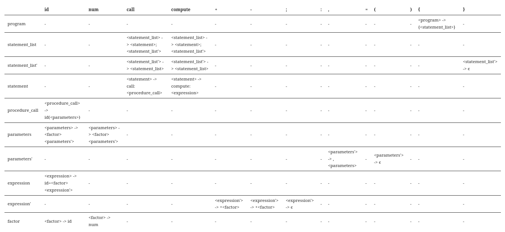

# SEG2106 - Assignment 3
Owen Daigle - 300359036

## Exercise 1:
We start with the following grammar:

```
<program> ::={<statement_list>} 
<statement_list> ::=<statement>;<statement_list> 
    | <statement>; 
<statement> ::=call: <procedure_call> 
    | compute: <expression> 
<procedure_call>::=id(<parameters>) 
<parameters>::=<factor>,<parameters> 
    | <factor> 
<expression> ::=id=<factor>+<factor> 
    | id=<factor>-<factor> 
    |id=<factor> 
<factor> ::=id|num 
```

We need to convert this into an LL1 grammar by removing left recursion and performing left factoring. 

### Left Factoring
This is where we have one non terminal that can derive multiple other non terminals, both with the same `FIRST()`. 

Here, `<statement_list>` has 2 derivations starting with `<statement>`, `<parameters>` has 2 derivations starting with `<factor>`, and `<expression>` has 3 derivations starting with `<factor>`

This can be fixed by removing the common part and putting it in a seperate nonterminal. 

For `<statement_list>`:
```
<statement_list> ::= <statement>;<statement_list'>
<statement_list'> ::= <statement_list>
    | Epsilon
```

For `<parameters>`:
```
<parameters> ::= <factor><parameters'>
<parameters'> ::= ,<parameters>
    | Epsilon
```
For `<expression>`:
```
<expression> ::= id=<factor><expression'>
<expression'> ::= +<factor>
    | -<factor>
    | Epsilon
```

Now the overall code becomes:
```
<program> ::={<statement_list>} 
<statement_list> ::= <statement>;<statement_list'>
<statement_list'> ::= <statement_list>
    | Epsilon 
<statement> ::=call: <procedure_call> 
    | compute: <expression> 
<procedure_call>::=id(<parameters>) 
<parameters> ::= <factor><parameters'>
<parameters'> ::= ,<parameters>
    | Epsilon
<expression> ::= id=<factor><expression'>
<expression'> ::= +<factor>
    | -<factor>
    | Epsilon
<factor> ::=id|num 
```

### Left Recursion

Left factoring is where some non terminal $A$ can derive another expression where the leftmost non terminal is $A$. So something like:

$A \implies A\alpha$

So if we had something like `<statement> :: <statement> <other non-terminal>` we would have to fix this by adding something like `<statement'>`.

Luckily we do not have any left recursion in this situation. 

## Excersise 3

First Sets:
```
FIRST(program) = {
FIRST(statement_list) = call compute
FIRST(statement_list') = call compute ϵ
FIRST(statement) = call compute
FIRST(procedure_call) = id
FIRST(parameters) = id num
FIRST(parameters') = , ϵ
FIRST(expression) = id
FIRST(expression') = + - ϵ
FIRST(factor) = id num
```

Follow Sets:
```
FOLLOW(program) = $
FOLLOW(statement_list) = }
FOLLOW(statement_list') = }
FOLLOW(statement) = ;
FOLLOW(procedure_call) = ;
FOLLOW(parameters) = )
FOLLOW(parameters') = )
FOLLOW(expression) = ;
FOLLOW(expression') = ;
FOLLOW(factor) = ; , + - )
```

To make the parse table, I put as columns all the terminals, and as the rows all the non terminals. 

For each terminal I go though its **first** set and use that to populate that row. If I come across an ϵ, I then *also add* that nonterminals **follow** set.

Parse Table:

